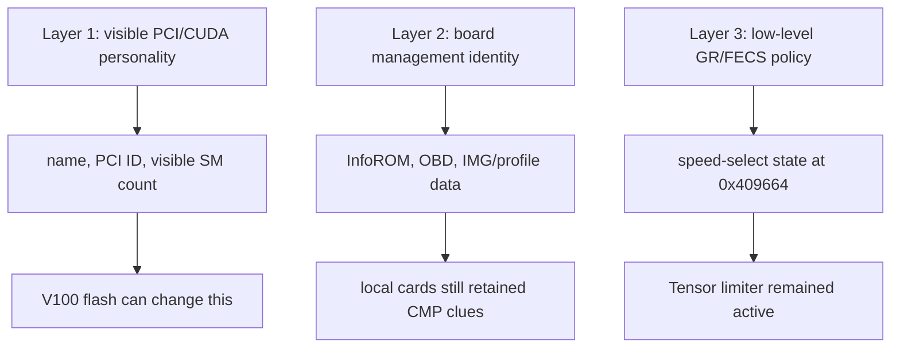
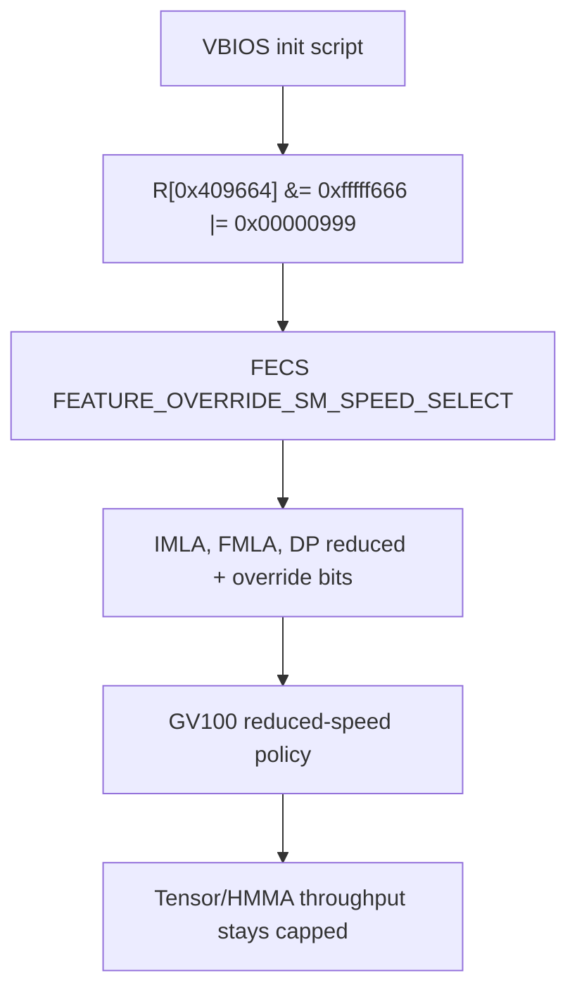
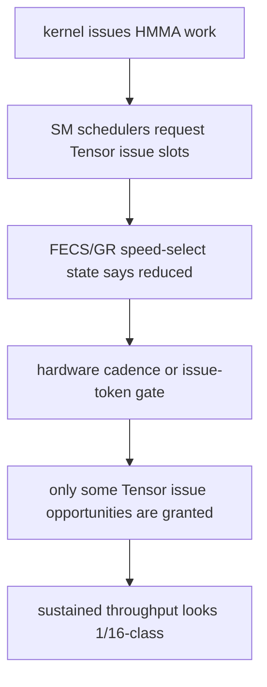

# GPU Falcon Research

Reverse-engineering the FECS speed-select limiter on NVIDIA CMP 100-210 (GV100) GPUs that refuse to deliver full Tesla V100 Tensor throughput after V100 firmware flashes.

## License

[MIT](LICENSE)

## The Hook

The CMP 100-210 is a crypto-mining-era card built on GV100 silicon -- the same chip as Tesla V100 and Titan V. Second-hand cards go for cheap. I bought 4 for ~$250, then a used Octominer from eBay with 12 more for $1500. ~$2k for 256GB of HBM2 VRAM with 13.28 TB/s aggregate bandwidth.

Some of the new batch came flashed with V100 firmware. They showed up as `Tesla V100-PCIE-12GB`, exposed 80 SMs instead of 68, and looked like real V100s in every way CUDA and `nvidia-smi` could see.

But they delivered roughly **1/16th** the Tensor/HMMA throughput of a real V100.

The question became: *what is holding them back, and can it be cleared?*

## The Answer (So Far)

The limiter lives in a single FECS register:

```
NV_PGRAPH_PRI_FECS_FEATURE_OVERRIDE_SM_SPEED_SELECT
BAR0 offset: 0x00409664
Value on capped cards: 0x00000999
```

Written during early VBIOS init, this register asserts reduced-speed policy for IMLA, FMLA, and DP math classes. The production software surfaces we found do not provide a normal way to clear it on GV100.

## The Three-Layer Model

The confusion around "it shows up as a V100, why doesn't it act like one" comes from three independent layers:



A VBIOS flash can change layers 1 and 2. Layer 3 -- the FECS speed-select policy -- stays asserted. That's why "it shows up like a V100" was never enough evidence.

## The Key Flow



## Why the Register Is a Dead End (For Now)

Every path to alter the register ends at a boundary:

| Path | What Happens |
|------|-------------|
| RM `GET_SM_ISSUE_RATE_MODIFIER` | Stubbed with `NV_ERR_NOT_SUPPORTED` on pre-Turing |
| Debug object (`NV83DE`) regops | Register denied by GV100 user access map |
| VBIOS flash | Changes identity, not FECS policy |
| Firmware/debugdump scans | Names appear, the speed-select producer does not |

The register tells the hardware to use reduced mode. The exact 1/16 implementation is likely in private fuse/POR/IFF data or signed FECS/GR policy below the visible source boundary.

## Where the 1/16 Probably Comes From



## Repository Structure

```
.
├── fecs-limiter-notes/    # Long-form research narrative with Mermaid diagrams
├── notes/                 # Dated research notes (probes, benchmarks, findings)
├── scripts/               # CUDA probe kernels (HMMA, DP4A, SGEMM, WMMA)
├── tools/                 # C/Python analysis tools (VBIOS decode, register probes)
└── runs/                  # Raw run data (gitignored)
```

## What Was Tried

Every branch converged on FECS speed-select. Every ordinary production path to alter it ended at a privilege, generation, or signature boundary:

| Branch | Why It Was Plausible | What Happened |
|--------|---------------------|---------------|
| Benchmarks and clocks | Most "slow GPU" bugs are measurement bugs | Slowdown tracked Tensor/HMMA issue behavior, not clocks |
| V100-personality VBIOS | Maybe identity was the whole lock | Changed visible behavior, not the Tensor limiter |
| VBIOS init scripts | Early init can write privileged registers | Capped images write `0x999` to `0x409664` |
| BAR0/FECS register probing | A live register would connect intent to state | `0x409664` became the central observable |
| RM issue-rate controls | A supported driver path would be cleanest | GV100 path stubbed as unsupported |
| RM regops and debug object | Debug objects sometimes expose lower-level access | Denied by GV100 user access map |
| Later-card source comparison | Later chips might show how NVIDIA represents this | They expose explicit multi-rate selectors including 1/16 |

## Key Findings

| Finding | Reference |
|---------|-----------|
| FECS register `0x409664` holds the speed-select state | [`fecs-limiter-notes/`](fecs-limiter-notes/) |
| VBIOS init scripts write `0x999` to this register on capped images | [`notes/nvdrv-backtrack-from-v100-baseline-2026-05-20.md`](notes/nvdrv-backtrack-from-v100-baseline-2026-05-20.md) |
| FP64 GEMM runs at 6.8-7.3% of V100 full-speed (DP_REDUCED) | [`notes/sgemm-dgemm-ratio-probe-2026-05-20.md`](notes/sgemm-dgemm-ratio-probe-2026-05-20.md) |
| V100 personality changes SM count but not the FMLA/HMMA cap | [`notes/local-tensor-sgemm-sweep-2026-05-20.md`](notes/local-tensor-sgemm-sweep-2026-05-20.md) |
| RM readback stubbed for pre-Turing (`GET_SM_ISSUE_RATE_MODIFIER`) | [`fecs-limiter-notes/docs/evidence-chain.md`](fecs-limiter-notes/docs/evidence-chain.md) |
| User access map denies `0x409660` and `0x409664` | [`fecs-limiter-notes/docs/debug-paths.md`](fecs-limiter-notes/docs/debug-paths.md) |

## Running the Probes

CUDA probe scripts in `scripts/` require CUDA 12+ and a Volta-class GPU:

```bash
nvcc scripts/hmma_issue_probe.cu -o hmma_probe
./hmma_probe

nvcc scripts/sgemm_dgemm_ratio_probe.cu -o sgemm_probe
./sgemm_probe
```

Python analysis tools in `tools/` work with VBIOS dumps and `nvidia-smi` CSV output.

## Reading the Notes

Start with [`fecs-limiter-notes/`](fecs-limiter-notes/) for the full narrative, then drill into supporting docs:

| Document | Purpose |
|----------|---------|
| `docs/evidence-chain.md` | Compact proof chain from symptom to FECS speed-select |
| `docs/source-map.md` | Source paths, line ranges, scoped snippets |
| `docs/experiment-log.md` | What was tried, why, and what each branch ruled out |
| `docs/registers-and-identities.md` | Register constants and identity layers |
| `docs/throughput-model.md` | Working model for burst behavior and global Tensor budget |
| `docs/blocked-paths.md` | Dead ends and boundaries |
| `docs/next-research.md` | What would actually produce new information |

## Scope

- Non-destructive, read-only investigation of owned hardware
- No firmware flashing, EEPROM overwrites, or active GPU disruption
- Documentation-only: no NVIDIA source files, firmware blobs, or leaked archives
