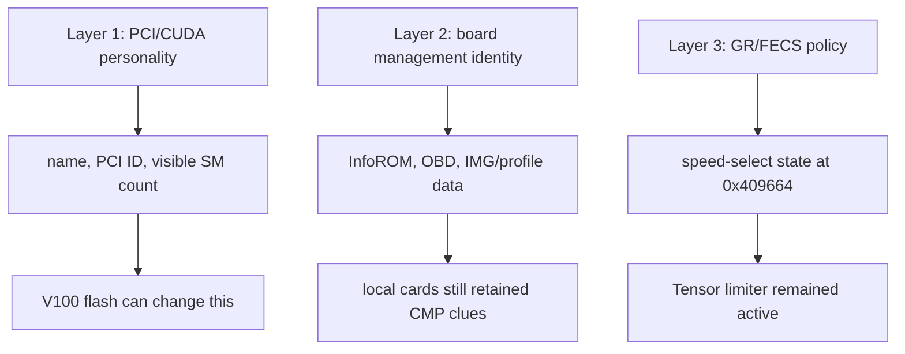

# GV100 FECS Limiter

[](./LICENSE)
[](https://github.com/jajmangold/gv100-fecs-limiter)
[](https://github.com/jajmangold/gv100-fecs-limiter)

Reverse-engineering the FECS speed-select limiter on NVIDIA CMP 100-210 (GV100) GPUs that refuse to deliver full Tesla V100 Tensor throughput after V100 firmware flashes. The leaked NVIDIA source tree gave us the register names -- hardware probing confirmed the mechanism.

---

## The Problem

CMP 100-210 cards are cheap GV100 silicon (same chip as Tesla V100). Flash V100 firmware and they *look* like V100s. But Tensor/HMMA throughput stays at **1/16th** of a real V100.

The limiter lives in a single register:

```
NV_PGRAPH_PRI_FECS_FEATURE_OVERRIDE_SM_SPEED_SELECT
BAR0 offset: 0x00409664
Value on capped cards: 0x00000999
```

## The Three-Layer Model

VBIOS flash changes layers 1 and 2. Layer 3 -- the FECS speed-select policy -- stays active.



## What the Leaked Source Revealed

The 2022 Lapsus$ NVIDIA ransomware leak included a Volta-era source tree with HAL dispatch tables, register definitions, and verification-only controls. This repo does not redistribute the tree -- but the source gave us a map.

### Register Definitions

From `volta/gv100/dev_graphics_nobundle.h`:

```c
#define NV_PGRAPH_PRI_FECS_FEATURE_OVERRIDE_SM_SPEED_SELECT      0x00409664
#define NV_PGRAPH_PRI_FECS_FEATURE_OVERRIDE_SM_SPEED_SELECT_IMLA 0:0
#define NV_PGRAPH_PRI_FECS_FEATURE_OVERRIDE_SM_SPEED_SELECT_FMLA 4:4
#define NV_PGRAPH_PRI_FECS_FEATURE_OVERRIDE_SM_SPEED_SELECT_DP   8:8
```

### HAL Dispatch -- Why GV100 Can't Read It

```perl
GET_SM_ISSUE_RATE_MODIFIER => [
    STUB_RETURNS  => NV_ERR_NOT_SUPPORTED,
    _TU102        => [ TURING, ],
    _GA100        => [ AMPERE_and_later, ],
    _STUB         => [ pre_TURING, ],
],
```

GV100 is pre-Turing. The readback path is deliberately stubbed. Meanwhile Ampere exposes explicit multi-rate selectors including the 1/16 value we measured:

```c
// grga100.c
ct_assert(NV2080_CTRL_GR_GET_SM_ISSUE_RATE_MODIFIER_FMLA32_REDUCED_SPEED_1_16 ==
          NV_FUSE_FEATURE_OVERRIDE_SM_SPEED_SELECT_FMLA32_REDUCED_SPEED_1_16);
```

### Access Map That Blocks Debuggers

The GV100 user access map denies exactly the two registers that matter:

```
0x00409660  NV_PGRAPH_PRI_FECS_FEATURE_READOUT
0x00409664  NV_PGRAPH_PRI_FECS_FEATURE_OVERRIDE_SM_SPEED_SELECT
```

## Every Path Is a Dead End (For Now)

| Path | What Happened |
|------|--------------|
| RM `GET_SM_ISSUE_RATE_MODIFIER` | Stubbed `NV_ERR_NOT_SUPPORTED` on pre-Turing |
| Debug object (`NV83DE`) regops | Register denied by GV100 user access map |
| VBIOS flash | Changes identity, not FECS policy |
| Firmware/debugdump scans | Names appear, the speed-select producer does not |

## Quick Start

Requires CUDA 12+ and a Volta-class GPU.

```bash
nvcc scripts/hmma_issue_probe.cu -o hmma_probe && ./hmma_probe
nvcc scripts/sgemm_dgemm_ratio_probe.cu -o sgemm_probe && ./sgemm_probe
```

Python analysis tools in `tools/` work with VBIOS dumps and `nvidia-smi` CSV output.

## Features

| Capability | Description |
|-----------|-------------|
| CUDA probe kernels | HMMA, DP4A, SGEMM, WMMA throughput probes |
| BAR0 register probing | Direct FECS register reads via NVML/libnvidia |
| VBIOS decode | Offline VBIOS init script parsing and comparison |
| Leaked source analysis | Register definitions, HAL dispatch, access maps |
| Z3 constraint modeling | Formal analysis of speed-select state transitions |
| Evidence chain | Complete path from symptom to register to boundary |

## Repository Structure

```
├── fecs-limiter-notes/    # Full narrative research with Mermaid diagrams
│   └── docs/              # Evidence chain, source map, experiment log
├── notes/                 # Dated research notes
├── scripts/               # CUDA probe kernels (HMMA, DP4A, SGEMM, WMMA)
├── tools/                 # C/Python analysis (VBIOS decode, register probes)
└── runs/                  # Raw run data (gitignored)
```

## Documentation

| Document | Purpose |
|----------|---------|
| [`fecs-limiter-notes/docs/evidence-chain.md`](fecs-limiter-notes/docs/evidence-chain.md) | Compact proof chain from symptom to FECS speed-select |
| [`fecs-limiter-notes/docs/source-map.md`](fecs-limiter-notes/docs/source-map.md) | Source paths, line ranges, scoped snippets |
| [`fecs-limiter-notes/docs/experiment-log.md`](fecs-limiter-notes/docs/experiment-log.md) | What was tried, why, and what each branch ruled out |
| [`fecs-limiter-notes/docs/registers-and-identities.md`](fecs-limiter-notes/docs/registers-and-identities.md) | Register constants and identity layers |
| [`fecs-limiter-notes/docs/throughput-model.md`](fecs-limiter-notes/docs/throughput-model.md) | Working model for burst behavior and global Tensor budget |
| [`fecs-limiter-notes/docs/blocked-paths.md`](fecs-limiter-notes/docs/blocked-paths.md) | Dead ends and boundaries |
| [`fecs-limiter-notes/docs/next-research.md`](fecs-limiter-notes/docs/next-research.md) | What would actually produce new information |

## Contributing

This is a personal research project. Issues and PRs are welcome if you have relevant GPU firmware or NVIDIA driver internals experience.

## License

[MIT](LICENSE)

Non-destructive, read-only investigation of owned hardware. No firmware flashing, EEPROM overwrites, or active GPU disruption. No NVIDIA source files, firmware blobs, or leaked archives are redistributed.
