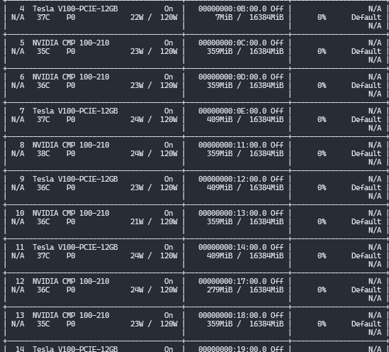
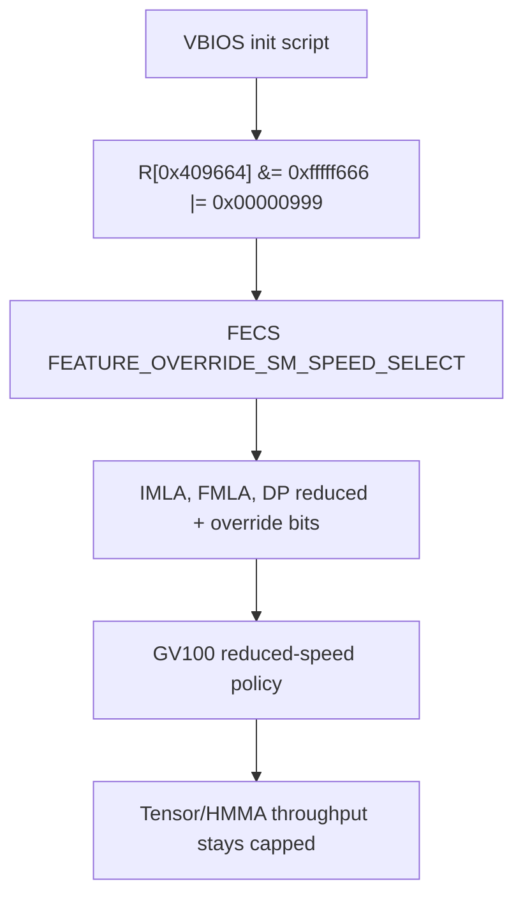
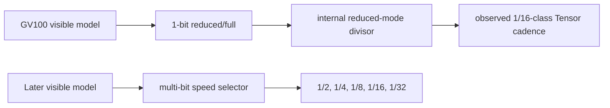
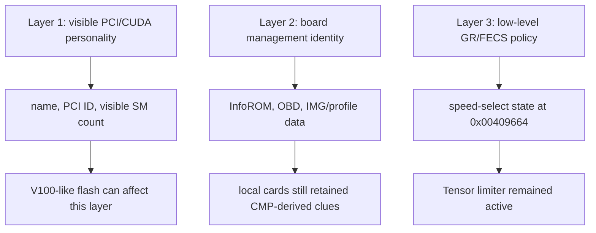
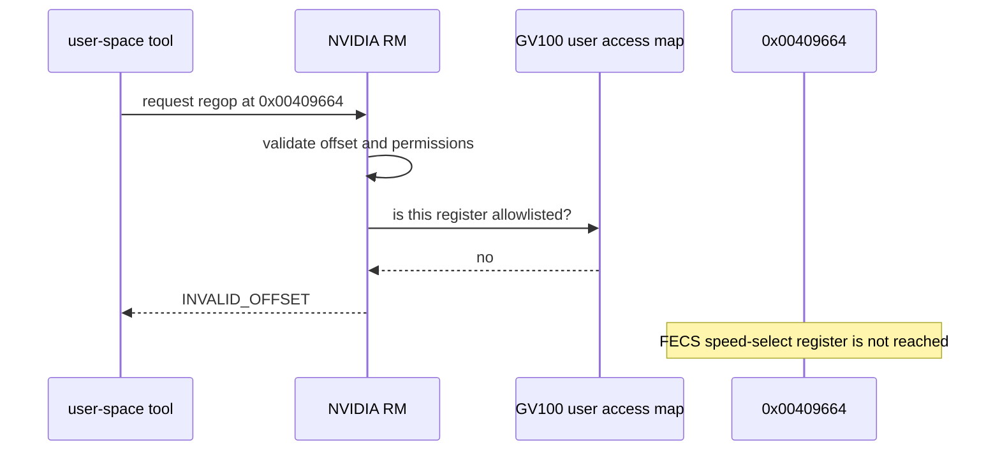
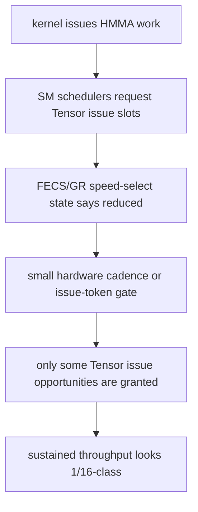

# The CMP 100-210 That Would Not Become A V100

This is a field report on a strange corner of NVIDIA GV100 hardware:
CMP 100-210 cards that were bought second-hand, flashed to look more like Tesla
V100 cards, and still refused to deliver full V100 Tensor throughput. 

**The Core Question: Why does CMP 100-210 deliver only 1/16th the full V100 Tensor performance?** 

The 2022 [ **Lapsus$** Nvidia ransomware leak](https://www.deepwatch.com/labs/nvidia-confirms-data-was-stolen-lapsus-takes-credit) shed some light.

That leak includes a vast amount of Nvidia internal Volta-era low-level device code for us to pour over.

The short version is easy to say and hard to prove:

```text
The cards can be made to look V100-like.
They can expose more of the chip than a stock CMP personality.
They still carry a FECS/GR speed-select limiter for Tensor-class math.
The most visible assertion point is BAR0 register 0x00409664.
On the capped cards, that register reads 0x00000999.
```

The longer version is the interesting part. It crosses VBIOS init scripts,
FECS register definitions, RM HAL dispatch, debug-object access maps, InfoROM
identities. This repo is the cleaned-up trail so the next person does not have to rediscover the same boundaries from scratch.

It is documentation only. It does not include NVIDIA source files, firmware
blobs, VBIOS ROMs, debug dumps, keys, exploit payloads, or links to leaked
archives.

## What This Card Is

The CMP 100-210 is a crypto-mining-era card built around GV100-class silicon,
the same generation as Tesla V100 and Titan V. That makes it irresistible to
hardware tinkerers: GV100 has serious compute hardware, including Tensor cores,
and used CMP cards are much cheaper than ordinary datacenter V100s. 

I bought them fully aware of the limitations (tensor core limits, pcie x1 and end of life Volta cores.) 

Why? LLMs *can* work great on these cards (if you learn to work around the pcie x1 thing). LLMs want memory bandwidth much more than compute - the massive memory bandwidth (830GB/s 4096-bit HBM2) and strong Cuda ALU performance is more than enough to drive a 16GB-class quantized LLM (or MOE expert shard). 

If you can limit what hits the pcie and everything is great. 

I bought 4 when they were still considered e-waste, paid maybe $250 total a couple years back. I realized they can be run throttled to 125w with no performance impact. They had been fast and effiecent for me - then I bought a used Octominer from eBay with 12 more for $1500. 

~$2k for 256GB of vram, with a cluster aggregate 13.28 TB/s of bandwidth. That's gotta be record or something. 

*I noticed some from the new batch came flashed with v100 firmware.*

But CMP products are segmentation products. They are not simply "V100s with a
different sticker." A board can share enough silicon lineage to enumerate in
familiar ways while still having product policy enforced below the layers that
CUDA, `nvidia-smi`, and PCI IDs normally show.

That distinction is the whole story here.




That flash was not meaningless: it affected
visible personality, naming, and exposed resources. It was also not the whole
unlock. The cards still behaved like something deep inside the graphics
initialization path was telling the SM/Tensor schedulers to run in a reduced
mode.

## The Hope

The original practical goal was simple:

```text
Can these CMP 100-210 cards be made to run Tensor/HMMA workloads like a full Tesla V100?
```

That question quickly split into better questions:

```text
Is the slowdown just a benchmark or clocking mistake?
Did the V100 flash fail, or did it only change the visible identity?
Is there a register holding the limiter state?
Does RM expose a supported readback or override path?
Can debug regops reach the FECS register?
Is the exact 1/16 behavior in VBIOS, InfoROM, fuses, or firmware policy?
```

The answer we ended with is bounded, not magical: the limiter is real, it is
visible at FECS speed-select state, and the production software surfaces we
found do not provide a normal way to clear it on GV100/CMP.

## Why The 2022 Source Tree Matters

The internal-looking NVIDIA paths and symbols referenced in these notes come
from a local source tree originating from the 2022 Lapsus$ NVIDIA
extortion/ransom leak. That provenance matters because the tree contains names
and HAL boundaries that are not available in normal public headers.

The source tree did not give us a turnkey unlock. What it gave us was a map of
what NVIDIA calls things:

```text
FECS
SM_SPEED_SELECT
FEATURE_READOUT
FEATURE_OVERRIDE
RMOverrideSmSpeedSelect
GET_SM_ISSUE_RATE_MODIFIER
RMSchMicroSched
user register access maps
```

Those names let the investigation connect live hardware values, decoded VBIOS
operations, and driver/firmware surfaces without guessing from raw offsets
alone. This repo keeps only small, claim-specific snippets and path references;
it does not redistribute the tree.

## The Register That Made The Case Coherent

The investigation became much less speculative when the same register kept
showing up from three directions:

```text
Name:        NV_PGRAPH_PRI_FECS_FEATURE_OVERRIDE_SM_SPEED_SELECT
BAR0 offset: 0x00409664
Local value: 0x00000999 on capped cards
Role:        FECS speed-select override state for multiple math classes
```

The matching readout surface is nearby:

```text
Name:        NV_PGRAPH_PRI_FECS_FEATURE_READOUT
BAR0 offset: 0x00409660
Role:        FECS feature readout, including GV100 speed-select state
```

The strongest decoded VBIOS clue was this init-script operation on
CMP-derived/capped images:

```text
NV_REG R[0x409664] &= 0xfffff666 |= 0x00000999
```

That line matters because it is not a CUDA preference, not an application
setting, and not a late benchmark artifact. It is early board/GPU
initialization writing the FECS speed-select override field.



The diagram is intentionally small because this is the key flow: a VBIOS init
operation asserts a FECS speed-select override, and the observed workload class
matches the register family.

## What `0x00000999` Means

GV100 exposes an older binary model for these fields:

```text
FULL_SPEED
REDUCED_SPEED
```

The `0x00000999` value lines up with reduced-speed plus override bits for:

```text
IMLA  integer multiply-add related state
FMLA  Tensor/HMMA-adjacent floating multiply-add state
DP    double-precision related state
```

That explains why the value felt like a smoking gun but not the whole
solution. The register tells the hardware to use reduced mode. It does not, in
the visible GV100 material, say "1/16."

Later architectures are more explicit. Turing/Ampere-era source surfaces
include selector values such as:

```text
FMLA16_REDUCED_SPEED_1_2
FMLA16_REDUCED_SPEED_1_4
FMLA16_REDUCED_SPEED_1_8
FMLA16_REDUCED_SPEED_1_16
FMLA16_REDUCED_SPEED_1_32
```

That generation split is important. It suggests the GV100-era visible bit is
one abstraction above the real cadence, while later chips expose the cadence as
a multi-bit selector.



This is the missing middle of the story: we can see the reduced-mode command,
and we can measure the 1/16-class result, but the exact GV100 implementation
of "reduced" is below the visible production source boundary.

## Why We Did Not Start With The Register

A good debugging path starts by distrusting the exciting theory. A slow GPU can
be slow for boring reasons:

```text
bad benchmark assumptions
power or clock limits
thermal throttling
wrong CUDA path
memory bottlenecks
driver mismatch
partial SM exposure
PCIe or persistence configuration
```

Those had to be ruled out before the firmware theory was worth much. The
reason the FECS path survived is that the slowdown followed the math issue
class more than the visible product identity. A V100-personality card could
look more like a V100, expose more resources, and still keep the Tensor-class
limiter.

That pushed the investigation below CUDA and below the normal PCI marketing
identity layer.

## The V100 BIOS Trap

The eBay cards with V100-like VBIOS images are what made this investigation
subtle. If a card changes name, PCI identity, or visible SM count after a flash,
it is natural to think the flash found the lock.

It did not.

The clean way to think about it is three layers:



That model explains the confusing part: a flash can make progress without
finishing the job. It can change how much of the chip the driver exposes while
leaving the FECS speed-select policy asserted.

This is why "it shows up like a V100" was not enough. The benchmark and the
register state were stronger evidence than the name.

## The Source Backtracking

Once `0x409664` was in focus, the source search became disciplined. We were
not looking for every reference to GV100. We were looking for the names that
would have to exist if NVIDIA's own code knew about this mechanism:

```text
SM_SPEED_SELECT
FEATURE_READOUT
FEATURE_OVERRIDE
FMLA
IMLA
DP
GET_SM_ISSUE_RATE_MODIFIER
RMOverrideSmSpeedSelect
RMSchMicroSched
```

That search found a clean boundary.

| Layer | What We Found | Meaning |
|---|---|---|
| GV100 hwref | FECS readout and override fields | The register family is real on GV100. |
| GV100 CTXSW firmware headers | mirrored speed-select fields | FECS/ctxsw firmware knows the surface. |
| RM HAL dispatch | `GET_SM_ISSUE_RATE_MODIFIER` stubbed for pre-Turing | Public readback is intentionally unavailable for GV100. |
| Turing RM | reads FECS feature readout | Later public code uses the expected mechanism. |
| Ampere RM | reads FUSE feature readout | Later code exposes richer selector values. |
| Engineering notes | older 1-bit fuses replaced by newer 3-bit fuses | Confirms the generation transition. |

The crucial line is not "NVIDIA has no code for this." NVIDIA clearly has code
for speed-select policy. The line is that the visible GV100 production path
stops at binary reduced/full state, while the later public path exposes richer
divisors.

## Why RM Did Not Give Us A Clean Switch

The obvious hope was a Resource Manager control:

```text
ask RM what the issue-rate modifier is
ask RM to override it
clear the reduced selector
benchmark again
```

The source explains why that did not work on GV100:

```text
GET_SM_ISSUE_RATE_MODIFIER
  Turing: implemented
  Ampere and later: implemented
  pre-Turing: stubbed with NV_ERR_NOT_SUPPORTED
```

GV100 is pre-Turing. The public readback path is deliberately stubbed even
though the hardware register definitions exist.

There are also internal-looking hooks:

```text
RMOverrideSmSpeedSelect
RMOverrideSmSpeedSelect1
RMSchMicroSched
```

Those are valuable clues, because they show how NVIDIA engineers could model
or test speed-selection and scheduler slowdown. They were not a production
route on the local GV100/CMP cards. The visible apply paths are verification
or later-generation paths, not a normal "uncap this GV100" switch.

## Why The Debug Object Did Not Bypass It

The next tempting path was the debugger object:

```text
GT200_DEBUGGER / NV83DE
```

This was worth checking because debugger APIs often sit close to the metal.
If anything user-accessible could read or write an awkward register, a legacy
debug path was a plausible candidate.

The source showed the opposite. The debug object routes register operations
through the same validation machinery as other user-originated regops.



That is why the `INVALID_OFFSET` result helped. It did not unlock anything,
but it proved the failure was not random. The register was behind an explicit
user-access boundary.

The local access-map work found that these offsets are denied:

```text
0x00409660  NV_PGRAPH_PRI_FECS_FEATURE_READOUT
0x00409664  NV_PGRAPH_PRI_FECS_FEATURE_OVERRIDE_SM_SPEED_SELECT
```

## What We Tried, And Why

The branches below were not random. Each one represented a plausible place
where a vendor segmentation policy could live.

| Branch | Why It Was Plausible | What Happened |
|---|---|---|
| Benchmarks and clocks | Most "slow GPU" bugs are measurement or configuration bugs. | The slowdown tracked Tensor/HMMA issue behavior, not ordinary clocks. |
| V100-personality VBIOS | Previous owner had flashed some cards; maybe identity was the whole lock. | It changed visible behavior, but not the Tensor limiter. |
| VBIOS init scripts | Early init can write privileged registers before the driver settles. | Capped images write `0x00000999` to `0x409664`. |
| BAR0/FECS register probing | A live register would connect VBIOS intent to runtime state. | `0x00409664` became the central observable. |
| RM issue-rate controls | A supported driver path would be the cleanest answer. | GV100 path is stubbed as unsupported. |
| RM regops and debug object | Debug objects sometimes expose lower-level register access. | Denied by GV100 user access map. |
| InfoROM / OBD / identity | Board identity could feed the policy. | Useful clues, but not sufficient alone. |
| Firmware/debugdump scans | The 1/16 mapping might be visible in dumped firmware or symbols. | Names and surfaces appeared; the producer did not. |
| Later-card source comparison | Later chips might show how NVIDIA represents the same idea. | They expose explicit multi-rate selectors, including 1/16-class values. |

The pattern matters more than any single failed branch. Every useful path
converged on FECS speed-select state, and every ordinary production path to
alter it ended at a privilege, generation, or signature boundary.

## Where The 1/16 Probably Comes From

The strongest current model is not "some SMs are disabled." Visible SM count
and Tensor issue rate did not move together cleanly enough for that.

A better model is a global Tensor/HMMA issue cadence or budget gate:



That kind of mechanism is cheap to implement in hardware: a counter, grant
window, scheduler mask, or token cadence can reduce throughput without changing
the visible number of SMs. It also fits the way later chips expose divisors as
small selector fields.

This remains an inference. A conclusive proof would require one of:

```text
FECS/GR microcode showing the reduced-mode scheduling rule
private chipfuse / POR / IFF data naming the reduced divisor
internal documentation for GV100 reduced-speed behavior
hardware trace evidence of periodic Tensor issue grants
two otherwise-identical cards differing only in the speed-select producer
```

## Why This Does Not End With "Just Patch The BIOS"

If all we needed were a different PCI ID or a different product string, the
eBay flash would have solved the problem. If all we needed were a normal RM
control, the source would have given us a clean path. If all we needed were a
debug register operation, `NV83DE` or regops would have reached the FECS
offset.

The current boundary is lower:

```text
visible product identity       can be changed
visible resource exposure      can change
FECS speed-select policy       remains asserted
normal user/debug reg access   denies the target register
public GV100 issue readback    is stubbed
private/signed policy inputs   were not available
```

That does not prove no path exists. It proves the easy stories are wrong.

## Current Conclusion

The best current statement is:

```text
The CMP 100-210 Tensor limiter appears to be a GV100 FECS/GR speed-select
policy established during early initialization. The visible assertion point is
NV_PGRAPH_PRI_FECS_FEATURE_OVERRIDE_SM_SPEED_SELECT at BAR0 0x00409664, with
local capped cards showing 0x00000999. The exact 1/16 implementation is likely
below the visible GV100 public source boundary, in private fuse/POR/IFF data,
signed FECS/GR policy, or NVIDIA internal tooling.
```

That is not the answer we wanted, but it is a much better place to be than
"maybe the BIOS is wrong." We know what layer matters, which public paths fail,
and what kind of missing artifact would actually move the research forward.

## How To Read The Rest Of The Notes

Start with the story above, then use the supporting docs as drill-downs:

| File | Use It For |
|---|---|
| [docs/evidence-chain.md](docs/evidence-chain.md) | The compact proof chain from symptom to FECS speed-select. |
| [docs/source-map.md](docs/source-map.md) | Exact source paths, line ranges, and scoped snippets. |
| [docs/experiment-log.md](docs/experiment-log.md) | What was tried, why it was tried, and what each branch ruled out. |
| [docs/debug-paths.md](docs/debug-paths.md) | The NV83DE/debug/regops audit. |
| [docs/registers-and-identities.md](docs/registers-and-identities.md) | Register constants and identity layers. |
| [docs/throughput-model.md](docs/throughput-model.md) | The working model for burst behavior and global Tensor budget. |
| [docs/blocked-paths.md](docs/blocked-paths.md) | Dead ends and boundaries. |
| [docs/next-research.md](docs/next-research.md) | What would actually produce new information. |
| [docs/provenance.md](docs/provenance.md) | Source provenance and publication cautions. |
| [docs/glossary.md](docs/glossary.md) | Vocabulary for FECS, FMLA, IFF, OBD, and related terms. |
| [data/key-observations.md](data/key-observations.md) | Compact constants and observations. |

## Publication Scope

This repo is intended to be safe to publish as a research narrative and index.
Keep it that way:

```text
Do include:
  markdown summaries
  derived observations
  register names and offsets
  small scoped snippets
  public links that are independently legal to share

Do not include:
  NVIDIA source files
  leaked archives
  firmware blobs
  VBIOS ROM images without redistribution rights
  private keys or signatures
  debugdump zips
  probing binaries
  crash or exploit payloads
```

