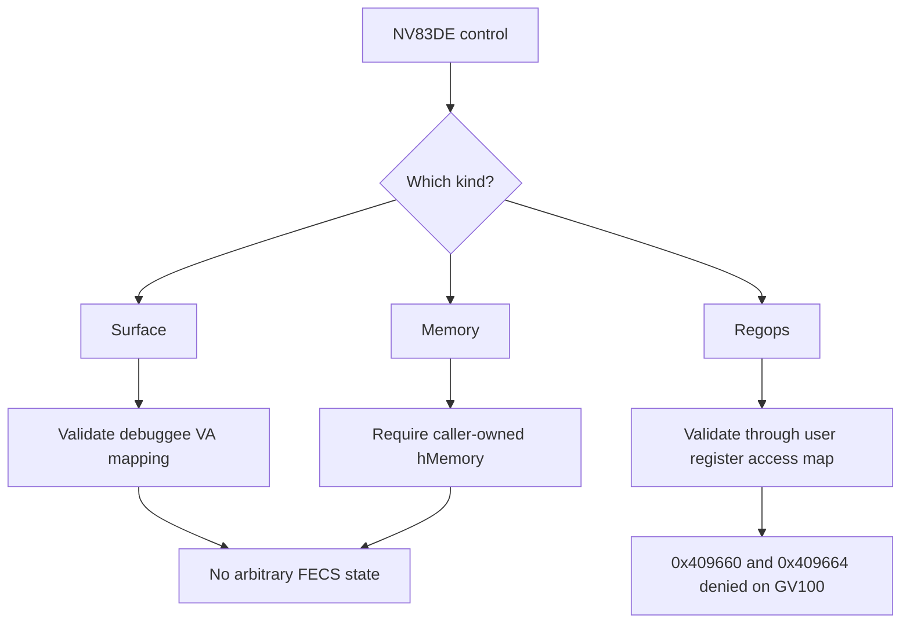

# Debug Path Audit

The closest normal-driver debug surface is the `GT200_DEBUGGER` / `NV83DE`
class.

Relevant control families:

```text
NV83DE_CTRL_CMD_READ_SURFACE
NV83DE_CTRL_CMD_WRITE_SURFACE
NV83DE_CTRL_CMD_GET_MAPPINGS
NV83DE_CTRL_CMD_DEBUG_READ_MEMORY
NV83DE_CTRL_CMD_DEBUG_WRITE_MEMORY
NV83DE_CTRL_CMD_DEBUG_EXEC_REG_OPS
NV83DE_CTRL_CMD_DEBUG_READ_BATCH_MEMORY
NV83DE_CTRL_CMD_DEBUG_WRITE_BATCH_MEMORY
```

Many are exported as non-privileged controls, but that does not mean they grant
unrestricted hardware access. The useful mental model is:



## Surface Access

Surface access validates a debuggee GPU virtual address range and copies pages
from mapped channel memory.

Useful for:

```text
debugger-visible channel VA mappings
CUDA/debug surface state
```

Not useful for:

```text
arbitrary FECS IMEM
arbitrary FECS DMEM
RM internal firmware allocations without a handle
```

## Debug Memory Access

Debug memory read/write requires an RM memory handle that belongs to the caller.

The implementation checks:

```text
caller has a resource ref for hMemory
hMemory is a Memory object
memdesc exists
length is nonzero
offset + length does not overflow
offset + length <= memdesc size
```

This can copy memory the caller already has rights to. It does not create a
handle for private FECS/GPCCS firmware memory.

## Debug Regops

`NV83DE_CTRL_CMD_DEBUG_EXEC_REG_OPS` calls:

```text
gpuValidateRegOps()
  -> gpuValidateRegOffset()
  -> user register access map
```

On GV100, the shipped access map denies:

```text
0x00409660 NV_PGRAPH_PRI_FECS_FEATURE_READOUT
0x00409664 NV_PGRAPH_PRI_FECS_FEATURE_OVERRIDE_SM_SPEED_SELECT
```

So `NV83DE` regops cannot reach the speed-select register in production.

Scoped source excerpt:

```c
NV_CHECK_OK_OR_RETURN(LEVEL_INFO,
    gpuValidateRegOps(pGpu, pParams->regOps, pParams->regOpCount,
                      pParams->bNonTransactional, isClientGspPlugin));
```

Source:

```text
drivers/resman/src/kernel/gpu/gr/kernel_sm_debugger_session_ctrl.c:688-691
```

## Verification-Only Access Map Edit

There is an internal diagnostic path:

```text
NV208F_CTRL_CMD_GPU_SET_USER_REGISTER_ACCESS_PERMISSIONS
```

The implementation is compiled only under:

```text
NV_VERIF_FEATURES
VERIF_ONLY_CONTROLS
```

That is probably the shape of an internal NVIDIA/MODS debug route, but it is
not a normal production control.

## Bounds-Audit Note

One asymmetry was found:

```text
DEBUG_READ_BATCH_MEMORY:
  checks dataOffset < dataLength

DEBUG_WRITE_BATCH_MEMORY:
  checks dataOffset + length <= dataLength
```

This is worth noting for code review, but it still sits behind the same
caller-owned `hMemory` and memdesc bounds. It is not, by itself, a route to the
FECS speed-select state.

Scoped source excerpt:

```c
// read batch
pParams->entries[i].dataOffset < pParams->dataLength

// write batch
(pParams->entries[i].dataOffset + pParams->entries[i].length) <= pParams->dataLength
```

Source:

```text
drivers/resman/src/kernel/gpu/gr/kernel_sm_debugger_session_ctrl.c:732-775
```
