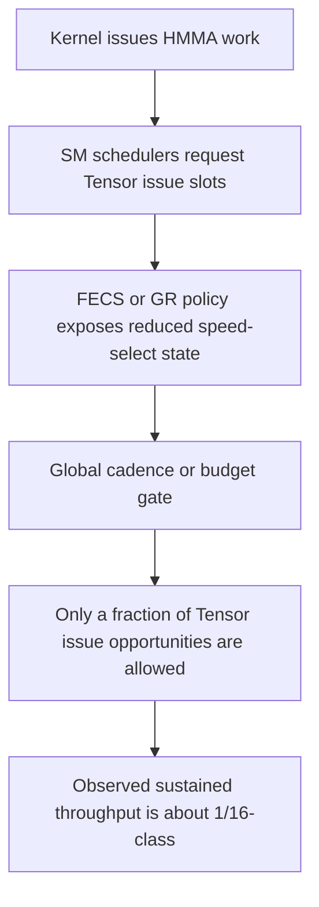

# Throughput Model

This page records the working model for the observed slowdown. It is an
inference from benchmarks plus the FECS speed-select evidence, not a recovered
microcode implementation.

## Observed Behavior

The local capped cards show:

```text
FP16 Tensor/HMMA throughput far below full V100 controls
reduced behavior persists across V100-personality flash
visible SM count can change without clearing the limiter
burst behavior can be shaped but not converted into sustained full throughput
concurrent streams conserve the reduced budget rather than multiplying it
```

## Most Likely Mechanism Class

The current best model is a global issue cadence or budget gate.



Why global budget is more likely than simple SM disable:

```text
visible SM count changes did not clear the limiter
many-block tests did not scale into full V100 throughput
concurrent streams shaped scheduling but conserved total Tensor budget
the policy bits live in a feature/scheduler control family, not a floorsweep mask
```

## Relationship To Later Chips

Later chips expose explicit selector values through FUSE/feature readout and
override fields.

```text
1/2
1/4
1/8
1/16
1/32
```

That suggests a cheap implementation:

```text
small hardware counter
issue-token cadence
scheduler mask
periodic grant window
```

For GV100, the visible bit only says:

```text
FULL_SPEED or REDUCED_SPEED
```

The internal reduced divisor appears to be fixed or selected by private policy.

## What Would Make This Conclusive

A conclusive mechanism proof would need one of:

```text
FECS/GR microcode showing the reduced-mode scheduler rule
private SKU/fuse/POR/IFF row naming the reduced divisor
internal documentation for GV100 SM_SPEED_SELECT reduced behavior
hardware trace proving periodic Tensor issue grants
full-speed and capped cards with identical identity except the speed-select producer
```

## What We Can Already Say

```text
The limiter is not explained by CUDA alone.
The limiter is not explained by visible SM count alone.
The limiter is not explained by OBD alone.
The limiter correlates directly with FECS speed-select override state.
The exact 1/16 implementation is below the visible GV100 public source boundary.
```

